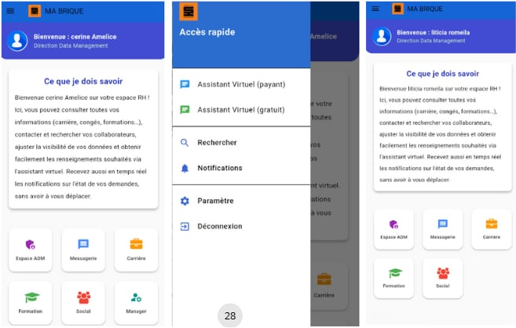
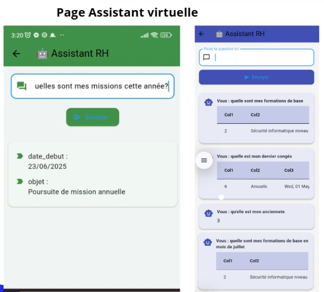

# Application RH avec Chatbot 🤖

Application mobile de gestion des ressources humaines avec intégration d’un chatbot intelligent.

---

## 🚀 Technologies utilisées

- Flutter & Dart (interface mobile)
- Python & Flask (backend chatbot)
- PostgreSQL (base de données RH)
- StarUML (modélisation UML)

---

## 📸 Captures d’écran de l’application

### 🏠 Écran d’accueil

### 🤖 Chatbot RH

### 🛠 Fonctionnalités RH

